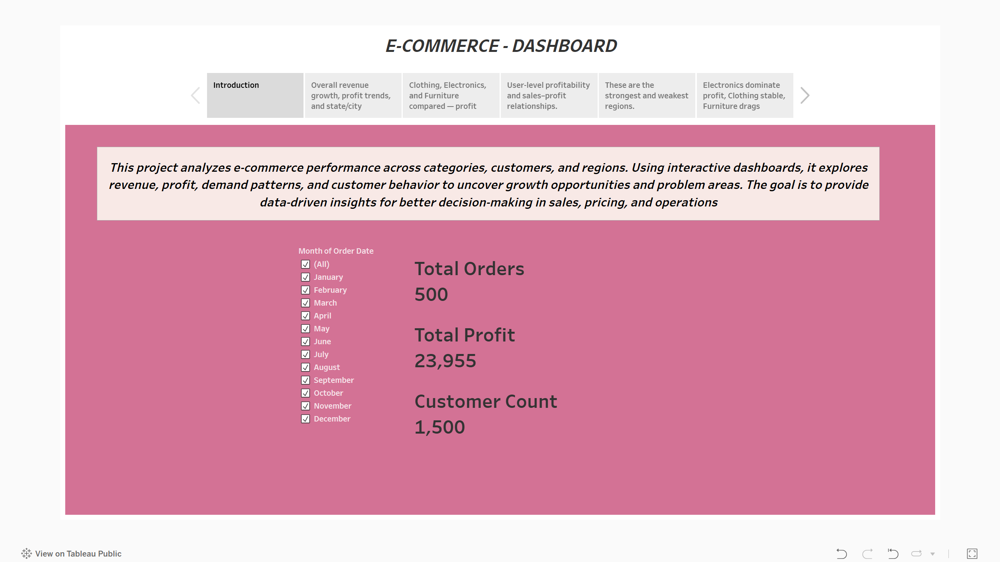
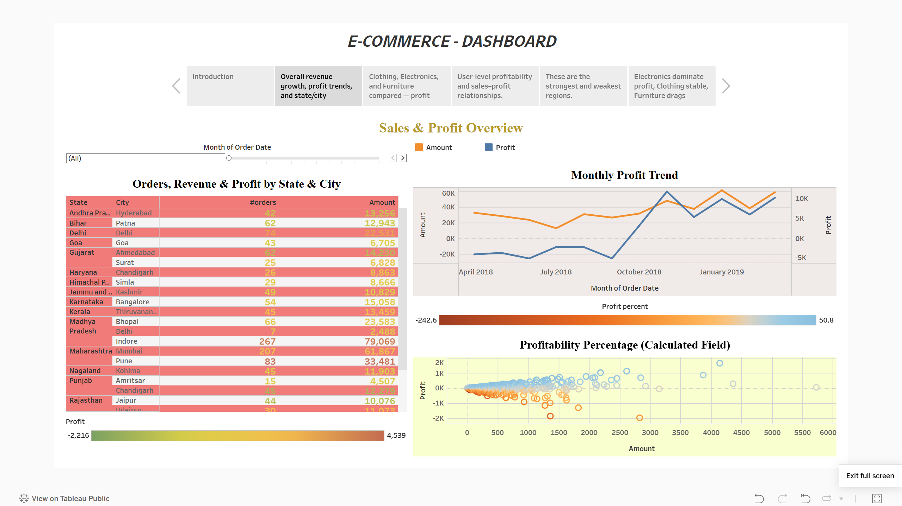
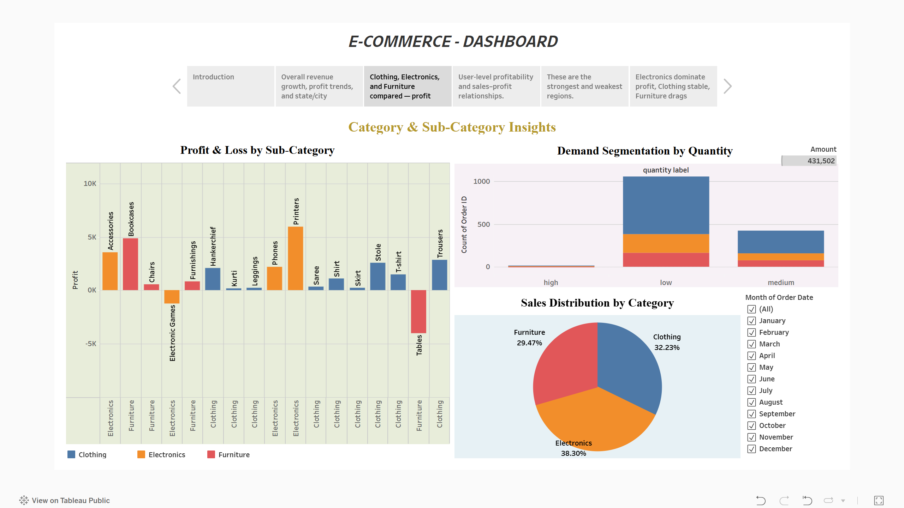
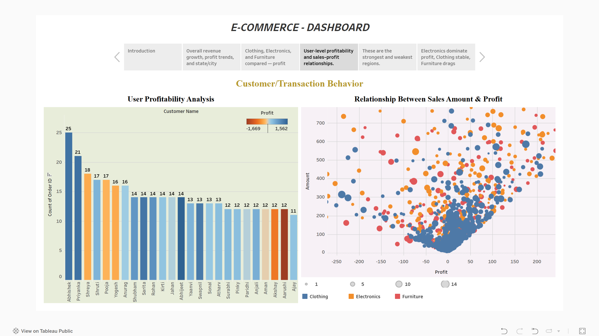
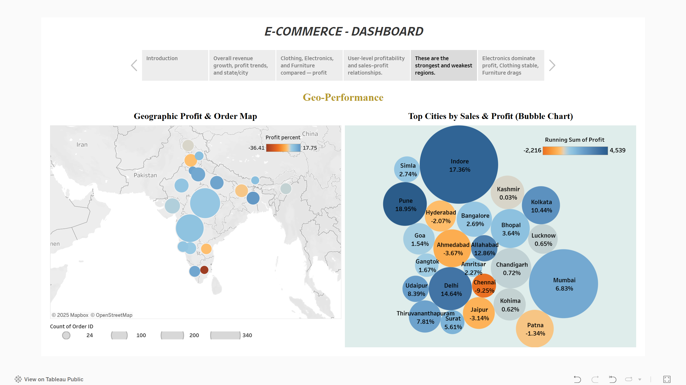
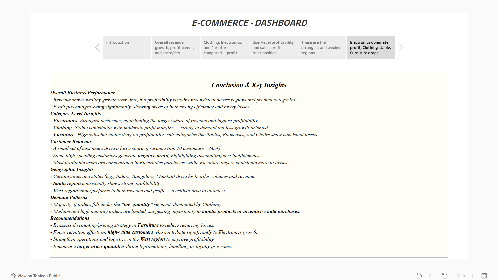

# 📊 E-Commerce Sales & Profit Analysis — Tableau


A compact, executive-ready Tableau project that analyzes e-commerce performance across **Clothing, Electronics, and Furniture**.  
It includes 4 interactive dashboards woven into a single **Tableau Story** with intro and conclusion slides.

---

## 🔗 Live Demo
**Tableau Public:**  
[View on Tableau Public](https://public.tableau.com/views/Ecommerce-Data-Visualization/Story1?:language=en-US&:sid=&:redirect=auth&:display_count=n&:origin=viz_share_link)

---

## Table of Contents
- [Project Overview](#project-overview)
- [Story Structure](#story-structure)
- [Dashboards & Interactions](#dashboards--interactions)
- [Calculated Fields](#calculated-fields)
- [Repository Structure](#repository-structure)
- [Getting Started](#getting-started)
- [Screenshots](#screenshots)
- [Key Insights)](#Key-Insights)
- [Data Notes](#data-notes)
- [License](#license)

---

## Project Overview
This project explores:
- Revenue and profit trends over time.
- Category ↔ sub-category performance (Clothing, Electronics, Furniture).
- Customer-level profitability and purchase behavior.
- State/city and regional performance.
- Actionable recommendations based on margins and demand patterns.

Built with **Tableau Desktop** and published to **Tableau Public** for easy sharing.

---

## Story Structure
The Tableau *Story* contains **6 sub-stories**:

1. **Introduction** — Scope, objectives, and how to read the dashboards.  
2. **Sales & Profit Overview** — KPIs, monthly trends, state/city breakdown.  
3. **Category & Sub-Category Insights** — Compare categories; identify profit drivers vs. loss-makers.  
4. **Customer & Transaction Behavior** — User-level profitability; sales ↔ profit correlation.  
5. **Geographic Performance** — Regional and city contributions to orders and profit.  
6. **Conclusion & Key Insights** — Final takeaways and recommended actions.

---

## Dashboards & Interactions
**Core interactions used across dashboards:**
- **Global Filters:** Date range, Category, Region.
- **Filter Actions:** Clicking a bar/slice/bubble filters other charts.
- **Highlight Actions:** Emphasize related data points on selection.
- **Tooltips:** Rich details (Profit %, Rank, Segment, Order Count).
- **Top-N Parameters:** Optional parameter to switch between Top/Bottom N views.

---

## Calculated Fields
- **Quantity Label** (demand segmentation)
  ```tableau
  IF [Quantity] >10 THEN 'high'
  ELSEIF [Quantity] >=5 AND [Quantity] <=10 THEN "medium"
  ELSE 'low'
  END
  ```
---

## Repository Structure

```
.
├── README.md
├── Tableau/
│   └── Ecommerce-Data-Visualization.twbx   
├── Data/
│   ├── List of Orders.csv
│   ├── Order Details.csv
│   └── Sales target.csv
├── Screenshots/
│   ├── dashboard_overview.png
│   ├── category_&_sub_category_insights.png
│   ├── customer_or_transaction_behavior.png
│   ├── geo_performance.png
│   ├── sale_&_profit_overview.png
│   └── conclusion.png
```
---

## Getting Started

**Option A — View Online**  
Open the Tableau Public link above.

**Option B — Open Locally**
1. Clone the repo:
   ```bash
   git clone https://github.com/ThE-GuY-sHuBhAm/e_commerce_dashboard_tableau
   cd <your-repo>
   ```
2. Open `Tableau/Ecommerce-Data-Visualization.twbx` in **Tableau Desktop** (or Tableau Public Desktop).

---

## Screenshots

| Slide                               | Preview                                                        |
| ----------------------------------: | :------------------------------------------------------------- |
| 1 — Dashboard Overview              |                |
| 2 — Sales & Profit Overview         |             |
| 3 — Category & Sub-Category Insights|   |
| 4 — Customer & Transaction Behavior |   |
| 5 — Geographic Performance          |                         |
| 6 — Conclusion & Key Insights       |                       |

---

## Key Insights

- **Sales & Profit Trends**:  
  Sales have shown steady month-on-month growth, but profit margins fluctuate, highlighting the impact of discounts and category mix.  

- **Category & Sub-Category**:  
  - **Electronics** consistently drive the highest sales and profit contribution.  
  - **Clothing** shows stable demand but slimmer margins — opportunities exist for bundling and upselling.  
  - **Furniture** records high sales volume but low or negative profitability, suggesting pricing and discount strategies need review.  

- **Customer & Transaction Behavior**:  
  - A small group of top customers accounts for a disproportionately high share of sales.  
  - Several high-spend customers generate losses due to aggressive discounting, creating a “profit leakage” risk.  

- **Geographic Performance**:  
  - Southern regions outperform others in both sales and profit.  
  - Western regions underperform, indicating potential logistics or pricing inefficiencies.  

- **Overall Takeaway**:  
  Focus on optimizing **Furniture margins**, tightening discount policies for loss-making customers, and expanding best practices from strong-performing geographies to weaker ones.


---

## Data Notes
- Dataset includes: `List of Orders.csv`, `Order Details.csv`, `Sales target.csv`.  
- Ensure fields: `Order ID`, `Order Date`, `Customer`, `City`, `State/Region`, `Category`, `Sub-Category`, `Sales`, `Quantity`, `Discount`, `Profit`.  
- Respect licensing/privacy before sharing raw data.

---

## License
This project is released under the **MIT License**. See `LICENSE` for details.  
If you use this as a template, please add attribution.

---
